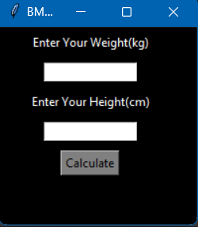

# BMI Calculator

BMI (Body Mass Index) Calculator is a simple Python application that calculates your BMI based on your weight (in kilograms) and height (in centimeters). It then provides you with an interpretation of your BMI category.

## How to Use

1. Clone the project to your computer or download it as a zip file.

2. Make sure you have Python installed on your system.

3. Run the application by executing the `bmi_calculator.py` file.

4. Enter your weight in kilograms in the "Enter Your Weight (kg)" field.

5. Enter your height in centimeters in the "Enter Your Height (cm)" field.

6. Click the "Calculate" button to calculate your BMI.

7. The application will display your BMI along with a message indicating your BMI category, such as "Normal," "Overweight," etc.

8. You can use this information to assess your body mass index.

